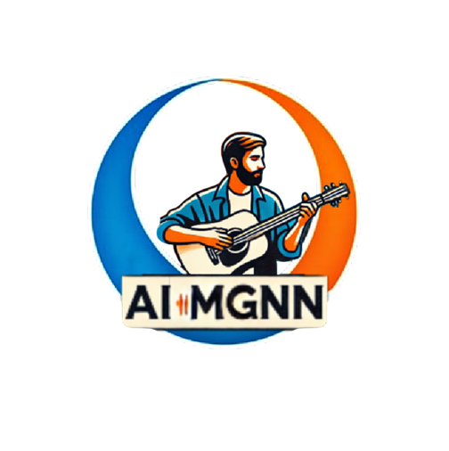

**AIMGNN**

## Table of Contents

* [Features](#features)
* [Repository Structure](#repository-structure)
* [Prerequisites](#prerequisites)
* [Installation & Setup](#installation--setup)
* [Usage](#usage)

  * [Generating Music via Frontend](#generating-music-via-frontend)
  * [User Workflow](#user-workflow)
* [API Endpoints](#api-endpoints)
* [Samples](#samples)
* [Citations](#citations)
* [Acknowledgments](#acknowledgments)

AIMGNN is a full-stack AI-powered music generation platform built with a vanilla JavaScript frontend and a Python FastAPI backend leveraging Meta's MusicGen model. Users can generate high-quality music by entering text prompts or uploading melody seeds, preview results in-browser, and download compositions.

---

## Features

* **Text-to-Music Generation:** Generate music from text prompts using advanced AI algorithms.
* **Customizable Music:** Edit and fine-tune generated music with prompt-based customization.
* **Download & Share:** Download your music in high-quality formats and share it with the world.
* **Advanced Controls:** Fine-tune tempo, pitch, and other parameters for precise control over your music.

---

## Repository Structure

```
AIMGNN/
├── css/                   # Stylesheets for frontend pages
├── gifs/                  # Animated previews and logos
├── images/                # Static images used in UI
├── js/                    # Vanilla JavaScript modules
├── music/                 # Generated or sample audio files
├── musicgen/              # Python code wrapping the MusicGen model
├── *.html                 # Frontend pages (index.html, generate.html, etc.)

├── README.md              # This file
├── requirements.txt       # Python dependencies
└── account.html, dashboard.html…  # Additional UI pages
```

---

## Prerequisites

* Python 3.8+ for backend services
* Git to clone the repository
* A modern web browser (Chrome, Firefox, Edge)

---

## Installation & Setup

1. **Clone the repo**:

   ```bash
   git clone https://github.com/OmarAsh-Dev/AIMGNN.git
   cd AIMGNN
   ```

2. **Install Python dependencies**:

   ```bash
   python3 -m venv venv
   source venv/bin/activate
   pip install -r requirements.txt
   ```

3. **(No build step needed)**

   * The frontend uses plain HTML, CSS, and JS; simply serve the `*.html`, `css/`, `js/`, and `images/` files.

4. **Download MusicGen weights** via Hugging Face:

   ```bash
   pip install transformers audiocraft
   ```

5. **Run Backend**:

   ```bash
   uvicorn musicgen.app:app --reload  # or python login.py if using Flask
   ```

6. **Serve Frontend**:

   * Option A: Place `*.html`, `css/`, `js/`, and `images/` under a static server (e.g., GitHub Pages, Vercel).
   * Option B: Run a Python HTTP server:

     ```bash
     cd AIMGNN
     python -m http.server 3000
     ```
   * Open `http://localhost:3000/index.html` in your browser.

---

## Usage

### Generating Music via Frontend

1. Navigate to **Generate** page (e.g., `generate.html`).
2. Enter a text prompt describing your desired music.
3. (Optional) Upload a melody seed (`.wav` or `.midi`).
4. Click **Generate**. The app calls the FastAPI endpoint and streams back an audio preview.
5. Listen inline or click **Download** to save the `.wav` file.

---

## User Workflow

**Generate Music:**

1. Enter a text prompt describing the type of music you want to create.
2. Click "Generate" to let the AI create a unique composition.

**Edit Music:**

1. Use the customization options to adjust tempo, pitch, and other parameters.
2. Fine-tune the music to match your creative vision.

**Download & Share:**

1. Once satisfied, download the music in your preferred format.
2. Share your creations with the world!

### API Endpoints

* `POST /predict` – Generate music from a text prompt. Accepts multipart form-data:

  * `prompt` (string)
  * `duration` (int, seconds)

* `POST /interpolation` – Generate an interpolation between a text prompt and an audio seed. Accepts multipart form-data:

  * `prompt` (string)
  * `melody` (file, audio or MIDI)
  * `duration` (int, seconds)

---


## Citations

AIMGNN builds on Meta AI’s MusicGen. Please cite:

```bibtex
@inproceedings{copet2023musicgen,
  title = {Simple and Controllable Music Generation},
  author = {Copet, Jade and Kreuk, Felix and Gat, Itai and Remez, Tal and Kant, David and Synnaeve, Gabriel and Adi, Yossi and Défossez, Alexandre},
  booktitle = {Proc. of the 40th International Conference on Machine Learning},
  year = {2023},
  note = {arXiv:2306.05284}
}
```

Underlying audio codec citation:

```bibtex
@misc{defossez2022encodec,
  title={EnCodec: Efficient Neural Audio Compression},
  author={Défossez, Alexandre and Zeghidour, Neil and Usunier, Nicolas and Bottou, Léon and Synnaeve, Gabriel},
  year={2022},
  eprint={2211.02231},
  archivePrefix={arXiv},
  primaryClass={cs.CV}
}
```

## Acknowledgments

* [MusicGen (Audiocraft)](https://github.com/facebookresearch/audiocraft) for the generative model
* Meta AI for open-sourcing state-of-the-art research
* Community contributors and early testers
